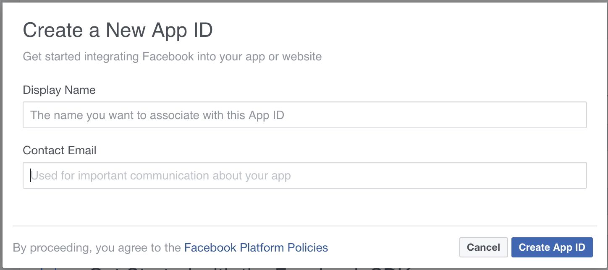
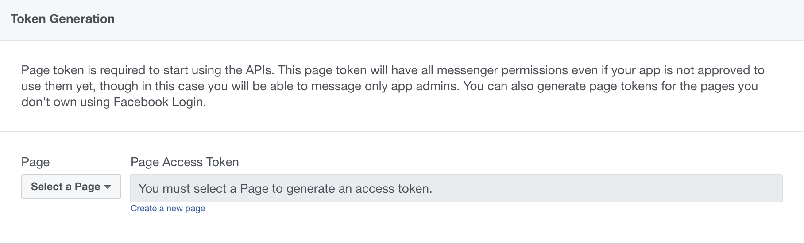
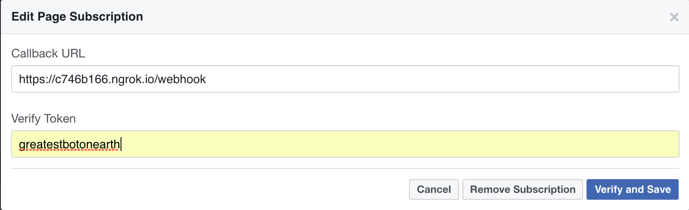

# Steps to use 
1. Git clone this repository
2. `npm install`
3. create a new facebook app at https://developers.facebook.com

4. Add messenger and Webhooks as products
5. Create a Facebook page
6. Generate page token for your page 

7. Use ngrok (https://ngrok.com/) to listen to a port (e.g., if your port is 3000) with the command `ngrok http 3000` 
8. `ngrok` generates a https URL for you (e.g., https://c746b166.ngrok.io) 
9. Fill in the callback url in the Facebook App as `https://c746b166.ngrok.io/webhook`

10. Create a verify token (can be anything you like)

11. Subscribe to the bot on Facebook App
12. Change the token, app secret and verify token in the config folder in this repository